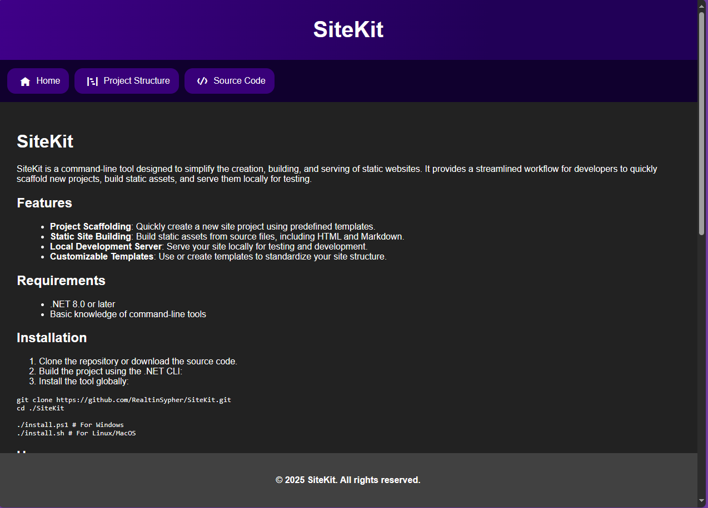

# SiteKit  


SiteKit is a command-line tool designed to simplify the creation, building, and serving of static websites. It provides a streamlined workflow for developers to quickly scaffold new projects, build static assets, and serve them locally for testing.  

## Features  
- **Project Scaffolding**: Quickly create a new site project using predefined templates.  
- **Static Site Building**: Build static assets from source files, including HTML and Markdown.  
- **Local Development Server**: Serve your site locally for testing and development.  
- **Customizable Templates**: Use or create templates to standardize your site structure.
- **Hot Reload**: Quickly make changes to your project and see them happen in realtime without rebuilding.

## Requirements  
- .NET 8.0 or later  
- Basic knowledge of command-line tools  

## Installation  

1. Clone the repository or download the source code.  
2. Build the project using the .NET CLI:
3. Install the tool globally:
```bash
git clone https://github.com/CodingBoson/SiteKit.git
cd ./SiteKit/SiteKit

./install.ps1 # For Windows
./install.sh # For Linux/MacOS
```
## Usage  

### Commands  

#### `new`  
Create a new site project.
- `siteName`: The name of the new site project.  
- `-t, --template`: (Optional) The template to use. Defaults to `default`.  

#### `build`  
Build the static site from source files.
#### `serve`  
Serve the site locally for testing.
- `-u, --url`: (Optional) The URL to serve the site. Defaults to `http://localhost:9443/`.  
- `-u, --url`: (Optional) The URL to serve the site. Defaults to `http://localhost:9443/`.  
- `--no-build`: (Optional) Skip the build step before serving.  

## Project Structure  

A typical SiteKit project has the following structure:
```bash
myBlog/
├─ Layout/         # Contains layout html files.
├─ Pages/          # Your Markdown or HTML pages
├─ wwwroot/        # CSS, images, JS, etc.
├─ sitekit.json    # Site configuration (title, properties, etc.)
└─ publish/        # Auto-generated static output
```

## Configuration  

The `sitekit.json` file contains the configuration for your site. Example:
```json
{
  "Name": "SiteKit",
  "Properties": {}
}
```

## Development  

### Building the Project  

To build the project, run:
~~~bash
sitekit build
~~~
### Running Tests  

To run the tests, use:
~~~bash
sitekit serve
~~~

## Examples
https://sitekit.secure-pages.uk Is built using SiteKit.

## Speed
SiteKit renders projects under 1 second.

## Templates
See the [Templates README](/Templates/README.md) file for more information.

## Contributing  

Contributions are welcome! Please follow these steps:  

1. Fork the repository.  
2. Create a new branch for your feature or bug fix.  
3. Commit your changes and push them to your fork.  
4. Submit a pull request.  

## License  

This project is licensed under the GPL-3.0 License. See the `LICENSE` file for details.  

## Acknowledgments  

- [Cocona](https://github.com/mayuki/Cocona) for command-line parsing.  
- [Markdig](https://github.com/xoofx/markdig) for Markdown processing.
- 

# Note:
A new successor to SiteKit, named 'WebKit,' is currently in development. 
This tool aims to provide a faster and more user-friendly solution for static web development.
It will be available on GitHub and the BosonWare Technologies organization.

## The New WebKit:

